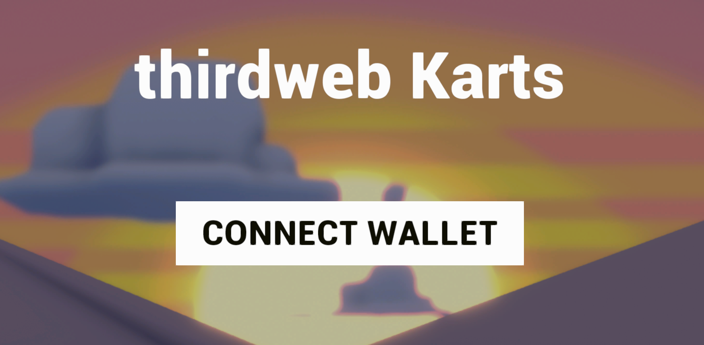
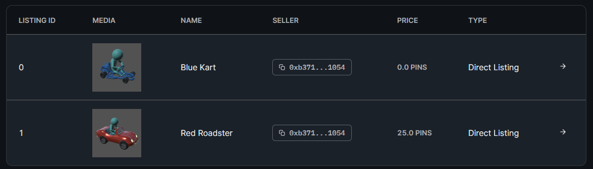

# Karting Game - Unity

Build a karting game in Unity using [GamingKit](https://portal.thirdweb.com/gamingkit) featuring:

- Playable vehicle NFTs with the [Edition Contract](https://portal.thirdweb.com/pre-built-contracts/edition) · [View Contract](https://thirdweb.com/optimism-goerli/0xB46A62FaCfd6834eCEeeF666cFa1A976a911D6Fe/nfts).
- In-game [Marketplace](https://portal.thirdweb.com/pre-built-contracts/marketplace) to purchase new vehicles · [View Contract](https://thirdweb.com/optimism-goerli/0x9b5283690D3161e61557b929C5846b1259c50693/listings).
- Earnable `$PIN` tokens claimable from a [Token Drop](https://portal.thirdweb.com/pre-built-contracts/token-drop) · [View Contract](https://thirdweb.com/optimism-goerli/0x4a9659d5E0d416Ce8B9a4336132012Af8db4c5AB/tokens).

**Preview:** [Play the game!](https://unity-karting-game.thirdweb-example.com/)


## How it works

Below, we'll outline the web3 features of the game enabled by [GamingKit](https://portal.thirdweb.com/gamingkit).

You can learn the features of the karting game itself from [Unity Learn: Karting Template](https://learn.unity.com/project/karting-template).

### Connect Wallet

New users first connect their wallet to the game:



This is achieved within the [`Web3.cs`](Assets/Karting/Scripts/Web3.cs) script:

- [Instantiating the SDK](https://portal.thirdweb.com/gamingkit/setting-up/instantiating-the-sdk)
- Requesting the user to [connect their wallet](https://portal.thirdweb.com/gamingkit/setting-up/connect-wallets)

```csharp
using Thirdweb;
using System.Threading.Tasks;

public class DemoClass : MonoBehaviour
{
    // Store the sdk so we can use it in any method of this classjb
    private ThirdwebSDK sdk;

    void OnEnable()
    {
        // When this becomes active, instantiate the SDK
        sdk = new ThirdwebSDK("optimism-goerli");
    }

    // When the user clicks "Connect Wallet":
    // - Ask them to connect their wallet
    // - Ask them to switch to Optimism Goerli network
    public async Task<string> EnsureWalletState()
    {
        string address = await sdk.wallet.Connect();
        await sdk.wallet.SwitchNetwork(420);
        return address;
    }
}

```

### Buying Vehicle NFTs

On the [marketplace](https://thirdweb.com/optimism-goerli/0x9b5283690D3161e61557b929C5846b1259c50693/listings) there is a listing for the two vehicles:



On the screen after the connect wallet button, the user can buy these vehicles using their [`$PIN` token](https://thirdweb.com/optimism-goerli/0x4a9659d5E0d416Ce8B9a4336132012Af8db4c5AB/tokens):


The first kart is free (`0 $PIN`), and the second kart costs `25 $PIN`.

To start the game the player purchases the blue kart with the below method:

```csharp
private Marketplace GetMarketplace()
{
    return sdk
        .GetContract("0x9b5283690D3161e61557b929C5846b1259c50693")
        .marketplace;
}

public async Task<TransactionResult> BuyItem(string listingId)
{
    var result = await GetMarketplace().BuyListing(listingId, 1);
}
```

When the transaction goes through, the button changes to display the `Drive Vehicle` text, and the player can begin to play the game with the purchased vehicle NFT.

### Core Gameplay

The core gameplay and assets are available as part of the [Unity Learn]() tutorials:

- [Karting Template](https://learn.unity.com/project/karting-template)
- [Crash Course Game Mode](https://learn.unity.com/tutorial/karting-mod-crash-course-game-mode)
- [Decorate Your World](https://learn.unity.com/tutorial/karting-mod-decorate-your-world)
- [Build Your Own Track](https://learn.unity.com/tutorial/karting-mod-build-your-own-track)

### Earnable `$PIN` Tokens

When the player wins, they are taken to the `WinScreen`, where they can claim `25 $PIN` tokens.

This is achieved using the [Token Drop Contract](https://portal.thirdweb.com/pre-built-contracts/token-drop) which is a way of releasing your ERC20 tokens.

> Note: Users can claim from the contract directly in this example. In a real game, you'd need to check the user has won the game before allowing them to receive tokens.

The logic for this can be seen in the [`TokenClaimer.cs`](Assets/Karting/Scripts/TokenClaimer.cs) script:

```csharp
private Contract getTokenDrop()
{
    return sdk.GetContract("0x4a9659d5E0d416Ce8B9a4336132012Af8db4c5AB");
}

public async void Claim()
{
    await getTokenDrop().ERC20.Claim("25");
}
```

At this point, the user can return to the marketplace and purchase the second vehicle for `25 $PIN`. They can then drive the second vehicle and repeat the process.

## Got Questions?

Jump into our [Discord](https://discord.com/invite/thirdweb) to speak with our team directly!
